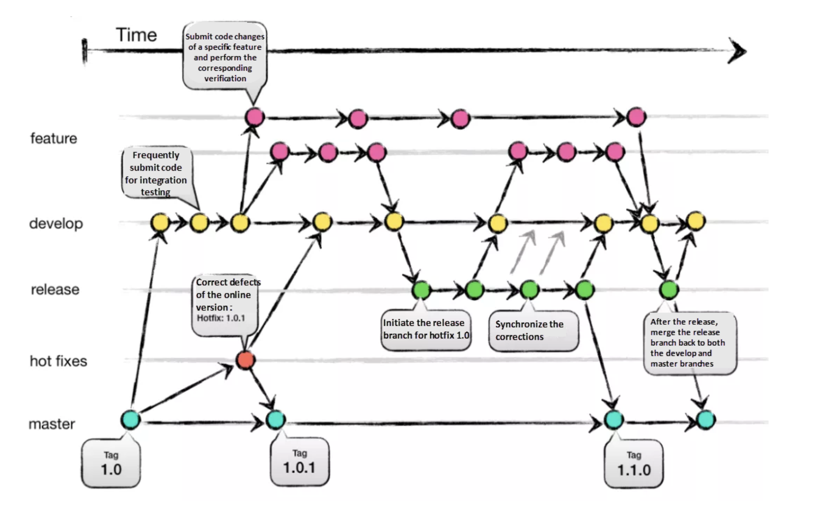

### **1️⃣ Git에서 Branch Merge 방법들과 각 방법의 특징을 설명해 주세요.**

#### **1. Fast-forward Merge**

브랜치 간에 새로운 커밋이 없을 때, 단순히 브랜치 포인터를 병합할 브랜치로 이동시키는 방식입니다.

**특징**

-   브랜치 히스토리가 깔끔하게 유지됩니다.
-   커밋이 추가되지 않으며, 브랜치 간에 충돌이 발생하지 않습니다.
-   병합 커밋이 생성되지 않으므로 병합 이력이 명확하지 않을 수 있습니다.

#### **2. 3-way-Merge (Recursive Merge)**

브랜치들이 각각 독립적인 커밋을 포함하고 있을 때, 공통 조상(commit)을 기준으로 병합을 시도하는 방식입니다.

**특징**

-   공통 조상(commit)을 기준으로 두 브랜치의 변경 사항을 비교하고 병합합니다.
-   병합 커밋이 생성되며, 이를 통해 병합된 히스토리를 추적할 수 있습니다.
-   충돌이 발생할 수 있으며, 충돌 해결이 필요할 수 있습니다.

#### **3. Rebase Merge**

브랜치의 커밋을 현재 브랜치 위에 다시 적용하여 병합하는 방식입니다.

**특징**

-   브랜치 히스토리를 깔끔하게 유지할 수 있으며, 병합 커밋 없이 작업을 통합할 수 있습니다.
-   커밋이 선형으로 정리되며, 각 브랜치의 변경 사항이 명확하게 반영됩니다.
-   충돌이 발생할 경우, 충돌 해결을 순차적으로 진행해야 합니다.

  

### **2️⃣ Git Flow 브랜치 전략에 대해 설명해 주세요.**

#### **Git branch 전략이란?**

Git branch 전략이란 여러 개발자가 하나의 저장소에서 작업할 때, 협업을 더욱 효과적으로 진행하기 위해 Git 브랜치에 대한 규칙을 설정하고 저장소를 잘 활용하기 위한 워크플로우를 정의하는 것입니다.

이러한 전략이 필요한 이유는 여러 개발자가 각기 다른 기능을 담당하는 브랜치를 사용하여 작업함으로써 개발 중인 기능이나 수정 사항이 서로 독립적으로 진행될 수 있기 때문입니다. 이에 따라, 서로 다른 작업이 서로에게 영향을 주지 않고 동시에 진행될 수 있습니다. 또한, 각 브랜치가 특정 기능이나 이슈에 대응하여 작업을 추적할 수 있게 해주며, 필요한 경우 작업 단위로 rollback이 가능하여 프로젝트 관리의 유연성을 높여줍니다.

#### **Git Flow**

다양한 브랜치 전략이 존재하지만, 가장 전통적으로 많이 사용되는 방식인 Git Flow에 대해 살펴보겠습니다.

Git Flow에는 5가지 종류의 브랜치가 존재합니다. 항상 유지되는 메인 브랜치들(main, develop)과 일정 기간 동안만 유지되는 보조 브랜치들(feature, release, hotfix)이 있습니다.

main : 항상 배포가 가능한 상태린 코드가 포함된 브랜치

develop : 새로운 기능 개발 및 통합이 이루어지는 브랜치

feature : 새로운 기능을 개발하기 위해 사용하는 브랜치

release : 릴리스 준비를 위한 브랜치

hotfix : 배포 후 긴급하게 버그를 수정하기 위한 브랜치

#### **Git Flow 개발 진행 흐름**

1.  신규 기능 개발 : 개발자는 develop 브랜치를 기준으로 feature 브랜치를 분기하여 진행합니다.
2.  기능 통합 : 작업이 완료된 feature 브랜치는 develop 브랜치로 병합(merge)됩니다. 일반적으로는 Pull Request를 통해 작업 내용을 리뷰 받은 후 해당 PR을 Merge하는 방식으로 진행합니다.
3.  릴리스 준비 : 다음 출시 버전을 위해 개발중인 develop 브랜치에 release 브랜치를 분기하여 배포 준비를 합니다. 이 과정에서 발견된 버그들은 release 브랜치에서 바로 수정합니다.
4.  제품 출시 : 충분한 테스트 후, 일정한 주기로(일반적으로 배포하고자 하는 버전 단위로) main 브랜치로 Merge하여 제품을 출시합니다.
5.  버그 수정 : 상용 배포 이후, release 브랜치에서 미처 발견되지 못한 새로운 버그들은 hotfix 브랜치에서 바로 수정됩니다.

이러한 Git Flwo를 통해 체계적이고 효율적인 개발 및 배포 과정을 관리할 수 있습니다.