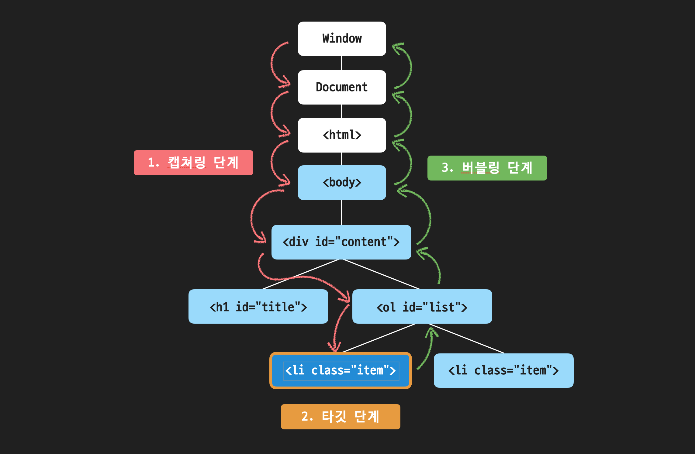

#### **📚 이벤트 버블링, 캡쳐링, 위임에 대해 설명해 주세요.**

이벤트 버블링, 캡쳐링, 위임은 웹 페이지에서 이벤트가 발생할 때, 그 **이벤트가 요소들 간에 어떻게 전파되고 처리 되는지** 설명하는 중요한 개념들입니다.

---

#### **이벤트 버블링 (**Event** Bubbling)**

\`이벤트 버블링\`은 **자식 요소에서 발생한 이벤트가 부모 요소까지 전파**되는 현상을 말합니다.

특정 요소에서 이벤트가 발생하면 해당 요소에 **등록된 이벤트 핸들러가 실행된 후**, 그 이벤트가 부모 요소로 전달되면서 **부모 요소에 등록된 이벤트 핸들러가 차례로 실행**됩니다. 이 과정은 최상위 요소에 도달할 때까지 계속되며, 이벤트가 아래에서 위로 올라가듯 전파되기 때문에 \`버블링\`이라는 용어를 사용합니다.

참고로 이벤트 버블링은 이벤트 객체의 \`stopPropagation\` 메소드로 전파를 막을 수 있지만, 정말 필요한 경우가 아니라면 이벤트 버블링을 막는 일은 피하는 것이 좋습니다.

---

캡쳐링은 이벤트가 발생하면 버블링의 반대 방향으로 진행되는 이벤트 전파 방식입니다.

[##_Image|kage@deMamF/btsJFHuKHOl/0ICFtq8Cr5678u25F5WVE0/img.png|CDM|1.3|{"originWidth":2286,"originHeight":1494,"style":"alignCenter","caption":"출처 Codeit","filename":"캡쳐링.png"}_##]

1.  이벤트가 \`window\` 객체에서 시작해 \`target\` 요소까지 순차적으로 전파됩니다. (캡쳐링 단계)
2.  이후, 이벤트가 타킷 요소에 도달하면 타깃이 등록된 이벤트 핸들러가 실행됩니다. (타깃 단계)
3.  마지막으로, 이벤트는 다시 \`window\` 객체로 전파되면서 상위 요소들로 전달됩니다. (버블링 단계)

캡쳐링 단계에서 이벤트 핸들러를 동작시키려면, \`addEventListener\`에 세번째 프로퍼티에 \`true\` 또는 \`{ capture: true }\`를 전달하면 됩니다.

**이벤트 캡쳐링 사용 사례**

**1\. 모달이나 팝업 외부 클릭 감지**

모달 창이나 팝업을 띄웠을 때, 사용자가 모달의 **외부를 클릭하면 모달이 닫히도록** 할 수 있습니다. 부모 요소(모달, 팝업의 뒷 배경)에서 클릭 이벤트를 처리하고, 모달 **내부에서 발생한 클릭은 무시하도록** 캡쳐링을 활용할 수 있습니다.

**2\. 폼 입력 필드 유효성 검사**

대형 폼에서는 **개별 입력 필드에 이벤트를 설정하는 것이 비효율적**이므로, 전체 폼에서 **한 번에 유효성 검사를 수행하고 오류를 처리하기 위해** 캡처링을 활용하는 것이 효율적입니다.

---

#### **이벤트 위임 (Event Delegation)**

버블링 개념을 활용하면 **자식 요소에 이벤트 핸들러를 하나씩 등록할 필요 없이 부모 요소에서 한 번에 자식 요소들에 발생한 이벤트를 관리**할 수 있고, 이렇게 이벤트를 다루는 방식을 자신 요소의 이벤트를 부모 요소에 위임한다고 해서 \`이벤트 위임(Event Delegation)\`이라고 한다.